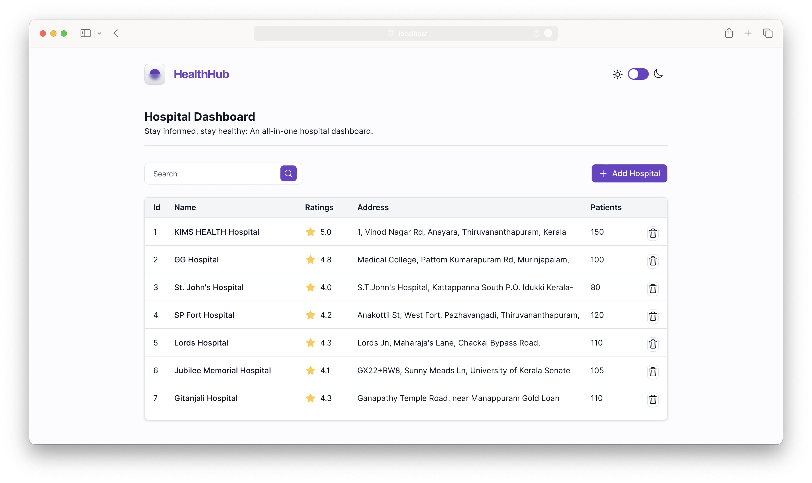

# Heatlth Hub

HealthHub is a hospital dashboard project that provides users with a comprehensive overview of different hospitals. The dashboard includes a table that displays important information about each hospital, including its name, ratings, address, and number of patients. This information can be sorted and filtered to help users find the hospital that best meets their needs.

---
## Requirements

For development, you will only need Node.js and a node global package, p, installed in your environement.

### Node
- #### Node installation on Windows

  Just go on [official Node.js website](https://nodejs.org/) and download the installer.
Also, be sure to have `git` available in your PATH, `npm` might need it (You can find git [here](https://git-scm.com/)).

- #### Node installation on Ubuntu

  You can install nodejs and npm easily with apt install, just run the following commands.

      $ sudo apt install nodejs
      $ sudo apt install npm

- #### Other Operating Systems
  You can find more information about the installation on the [official Node.js website](https://nodejs.org/) and the [official NPM website](https://npmjs.org/).

If the installation was successful, you should be able to run the following command.

    $ node --version
    v8.11.3

    $ npm --version
    6.1.0

If you need to update `npm`, you can make it using `npm`! Cool right? After running the following command, just open again the command line and be happy.

    $ npm install npm -g

### pnpm installation
After installing node, this project will need pnpm too, so just run the following command.

      $ npm install -g pnpm

---

## Install

    $ git clone https://github.com/YOUR_USERNAME/PROJECT_TITLE
    $ cd PROJECT_TITLE
    $ pnpm install

## Running the project

    $ pnpm start

---

